# Gacha Game (Inspired from League of Legends)

## Authors

- ASM CHAFIULLAH
- MAHEEN SABIR
- JAVERIA KALEEM
- SAYED ALA MOUDUDI
- SAMIULLAH KHAIRY

---

## Documentation and Game Rules
- [Game Rules]()
- [API Documentation]()
- [Architecture PDF]()
---
## Prerequisities
- docker
- docker compose
- postman
## How to Build and Run The Game

### 1. Clone the Repository

> git clone git@github.com:bhuiyan-chafi/gacha-game.git

> cd [your_repo]

> docker compose build --no-cache && docker compose up

This configuration is also recommended if you want to perform Integration Testing. For isolation testing please check the **Testing** section below.

> docker ps

**If the image is successfully built you will see a configuration like this:**

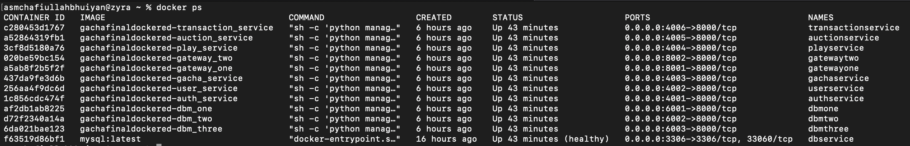
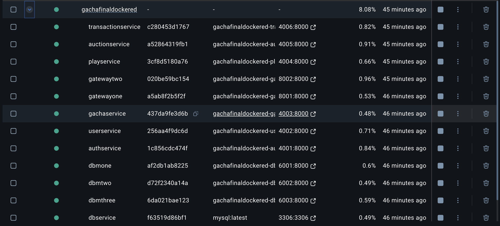

### 2. Import the APIs.json in your postman
[Integrated endpoints to play the game or perform integration testing](Docs/ApiDocs/Gateways.json)

### hostname and ports
The **Admin** endpoints are accessible from:
> https://localhost:8001

**Player** endpoints are accessible from:
> https://localhost:8002

But all the endpoints are explicitely mentioned in the varibales section of your postman collection:

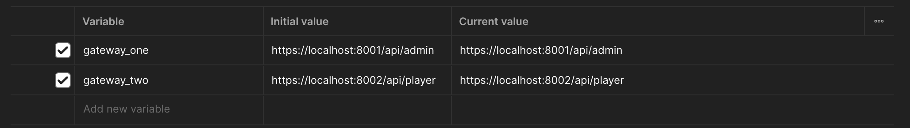

If you have imported the **API Endpoints** your postman collection should look like this:

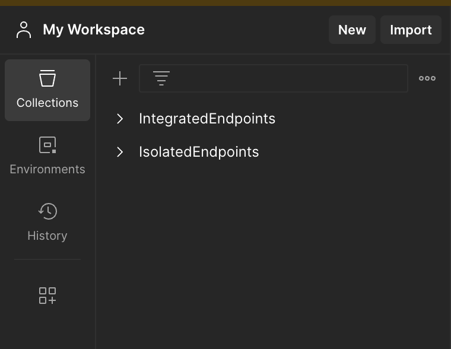

We have explained the **IsolatedEndpoints** testing part later in the **Testing** section.

## Tests [Integration Testing | Isolation Testing | Performance Testing]
### 1. Running Integration Tests

Mostly you will run problems for testing because of Authentication token. So if you encounter 401 and 403 make sure you have generated the appropriate token. Because admin and player specific endpoints require specified tokens. If you try to exploit the tokens it will not let you pass authorization. If you have generated the tokens and set them appropriately then you are good to go.

**Where to place the tokens?**
    
    Check each folders where we have set the token globally instead of specific endpoints. 

    Remember: Each token is valid for 5 hours

    Why this long?
    - Because it's tiring to change the token over and over again. You can later change the expiration time from AuthService > settings.py according to desired time limit.

### It's testing time:

- Generate two tokens: admin and player
- Place the tokens to desired parent folders

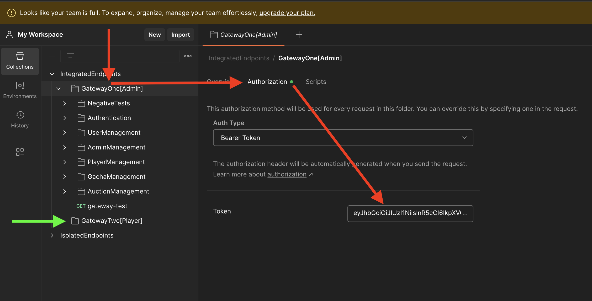

- Select the desired endpoints (for example: NegativeTests)
- Select Run 

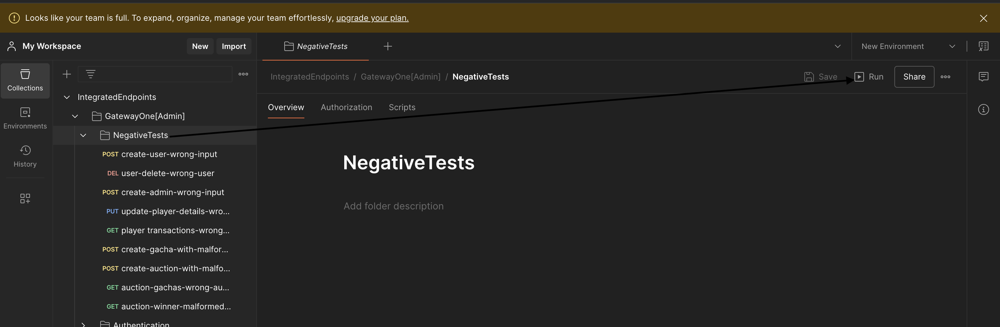

**Output**:

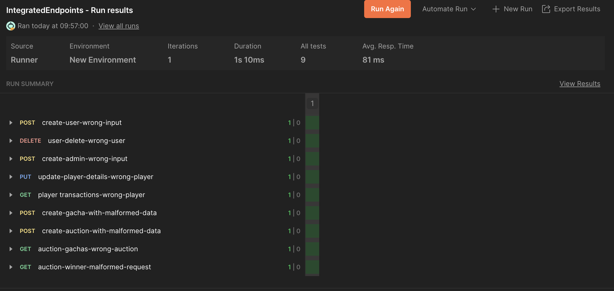

### Running Integration Test manually
---

You can also test each of the functionalities directly from the application level. To perform unit testing follow the given proceedure:
> docker exec -it 'container_name' /bin/sh

For example if we want to test **Gacha Service**

> docker exec -it gachaservice /bin/sh

> python manage.py test

Will give you the following output:

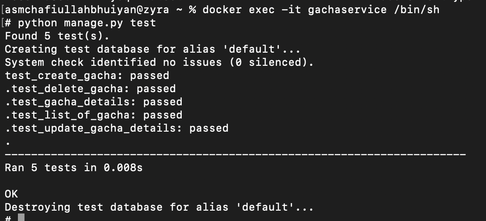

You can run any container using the container list to perform the tests. But this testing is more suitable for **Isolation** testing. 

### Isolation Testing 
---
The purpose of the isolation testing was to check the connectivity between multiple services. We have done isolation testing for each and every services but for example you can run one service to test. For example lets run **PlayServices** where players can roll to win a gacha and purchase a gacha directly.

### Getting the system ready
----
If you are running the system already then stop it and clear everything. Later you have to use another docker-compose file which is already given int he project root directory.

> docker compose -f docker-compose.isolated.yml build --no-cache && docker compose -f docker-compose.isolated.yml up 

Why different docker-compose file?
    
    Its nothing special, we just defined separated ports in each services so that we can run them via postman. But in real scenario the services run withing docker and the external network is unaware of the services, they are only executable from docker within.

Now, if you have successfully built the image and the containers are running then you can import the [Services.json](Docs/ApiDocs/Services.json) in your postman and test each service in isolation.

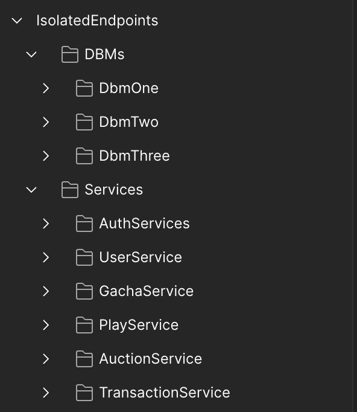

Now you can test each of these services as you want but remember the issue of **Authentication Tokens** that already has been discussed in the Integration Testing phase. 

### Running the test manually from application level
-----
You can also test the service in isolation from docker. The process has already been discussed. You can learn more about the testing from the [Report]()

### Performance Testing
---
We will perform performance testing using **Locust**. You can perform locust test directly from your machine as it works independently, if you don't want to install locust globally in your machine you can also test it from **ApiGatewayTwo** as we have virtualenv in our applications and locust is installed in **ApiGatewayTwo**. To start locust testing:

> cd ApiGatewayTwo

> pipenv shell

> pipenv --clear

> locust -f locust.py

Will start the **locust server** on http://localhost:8089/ which you can access from your browser. If locust is running correctly you should see this interface:
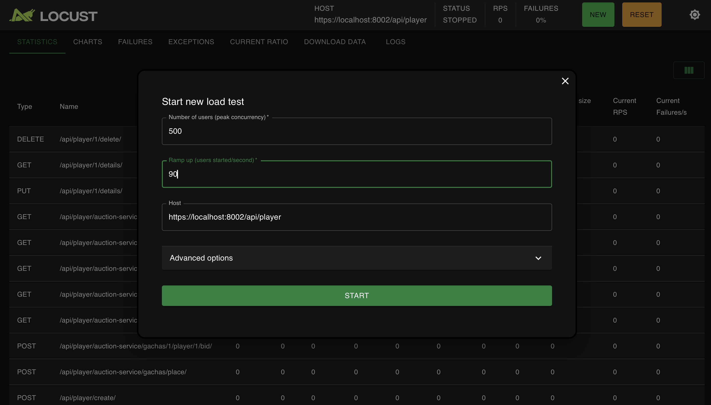

> Next step is to set your load parameters under which you want to test the application. 

> Press Start

The performance test will start and when you stop it, you can go to charts to see the performance:

Running Interface:

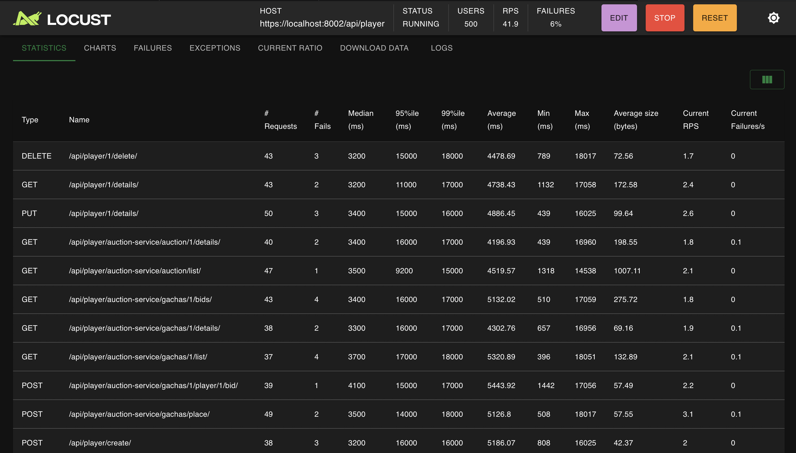

Result:

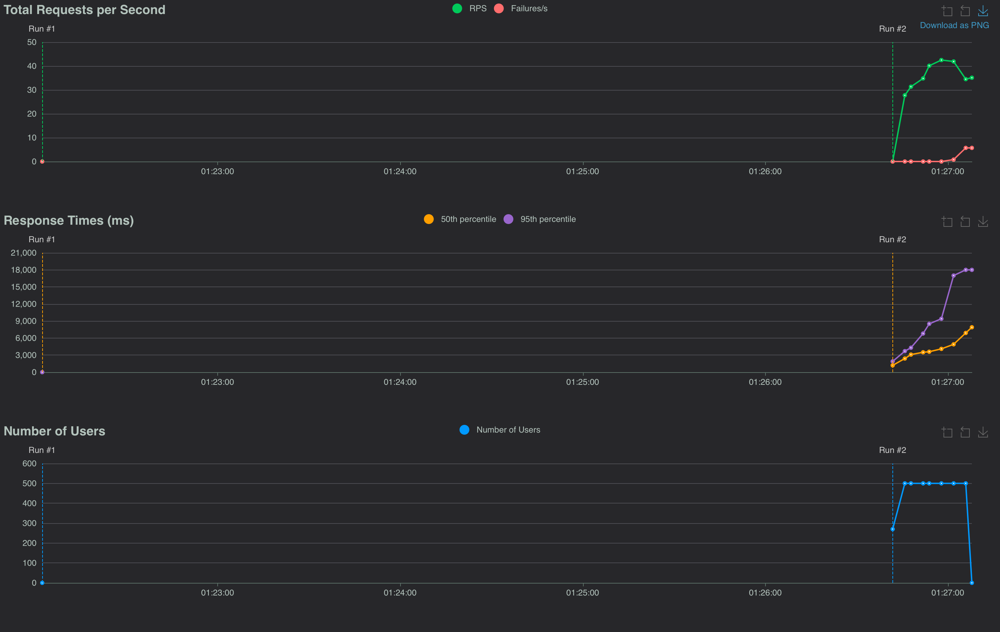

After stopping locust you will get another aggregated result from the terminal:

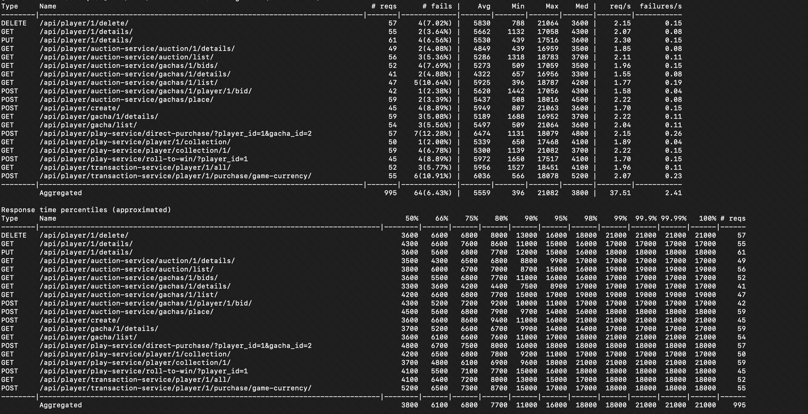